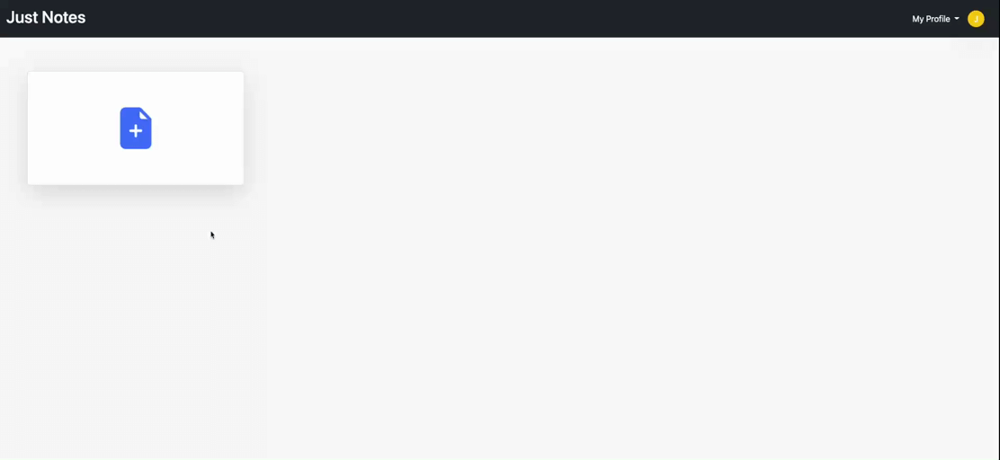
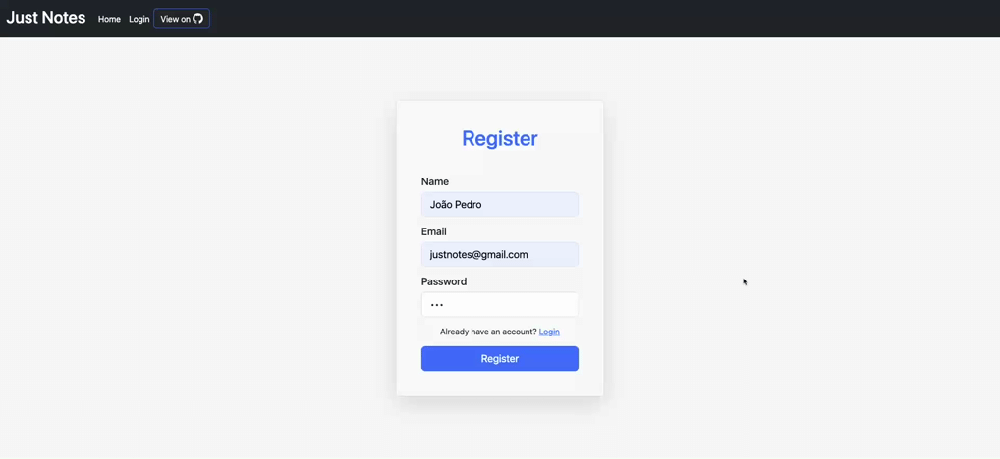

<h1 align='center'>Just Notes</h1>

<h3 align='center'>A simple notes app, similar to google docs and evernote</h3>



<p>

- <a href='#get-started'>Get Started</a>

  - <a href='#tools'>Necessary tools</a>
  - <a href='#env'>Environment settings</a>
  - <a href='#run'>Run project</a>

##

- <a href='#features'>Features</a>

  - <a href='#screen'>Screen responsiveness</a>
  - <a href='#auth'>Authentication and Logout</a>

##

- <a href='#technologies'>Technologies 🚀</a>

</p>

<a id='get-started'></a>

#

# Get Started

<a id="tools"></a>

### Necessary tools

- <a href='https://www.mongodb.com/home'>MongoDB</a>

<a id="env"></a>

#

### before starting the project you need to create an <a href='https://www.npmjs.com/package/dotenv'>.env</a> file and change the variables

```sh
MONGODB_PORT='Your mongodb url'
SECRET='Create a random secret for jwt'
```

### after

```sh
yarn install or npm install
```

<a id="run"></a>

#

### To start the project, run :

```sh
yarn start
```

<p>or</p>

```sh
npm start
```

### Then, open <a href='http://localhost:4000/'>http://localhost:4000/</a> in browser

<a id="features"></a>

#

<a id="screen"></a>

# Features

### Screen responsiveness


<a id="auth"></a>

#

### Authentication and Logout



<a id="technologies"></a>

#

# 🚀 Technologies

<ul>
    <li>nodejs</li>
    <li>express</li>
    <li>ejs</li>
    <li>jwt</li>
    <li>bootstrap</li>
    <li>mongodb</li>
    <li>mongoose</li>
</ul>

##

<div >
  <h3>My linkedin</h3>
  <a href="https://www.linkedin.com/in/joao-pedro-mello/" target='_blank'></a>
</div>

##

Made by João Pedro
